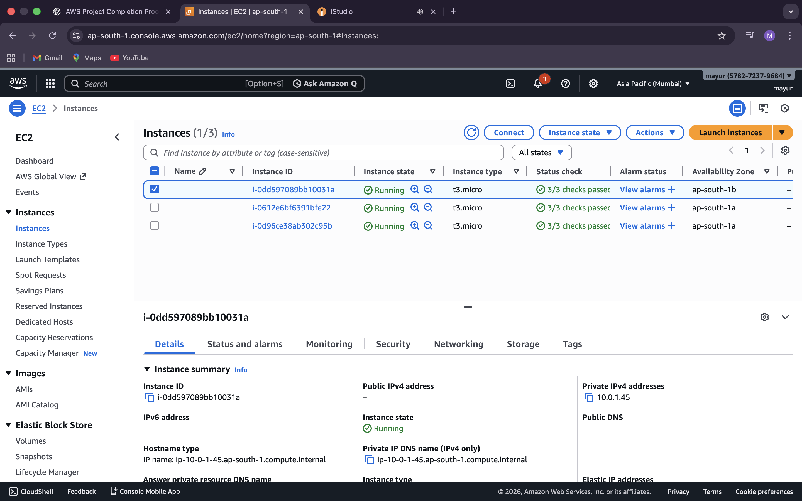
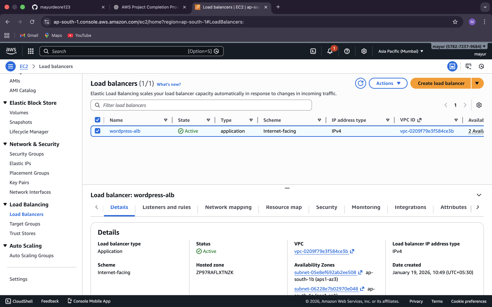
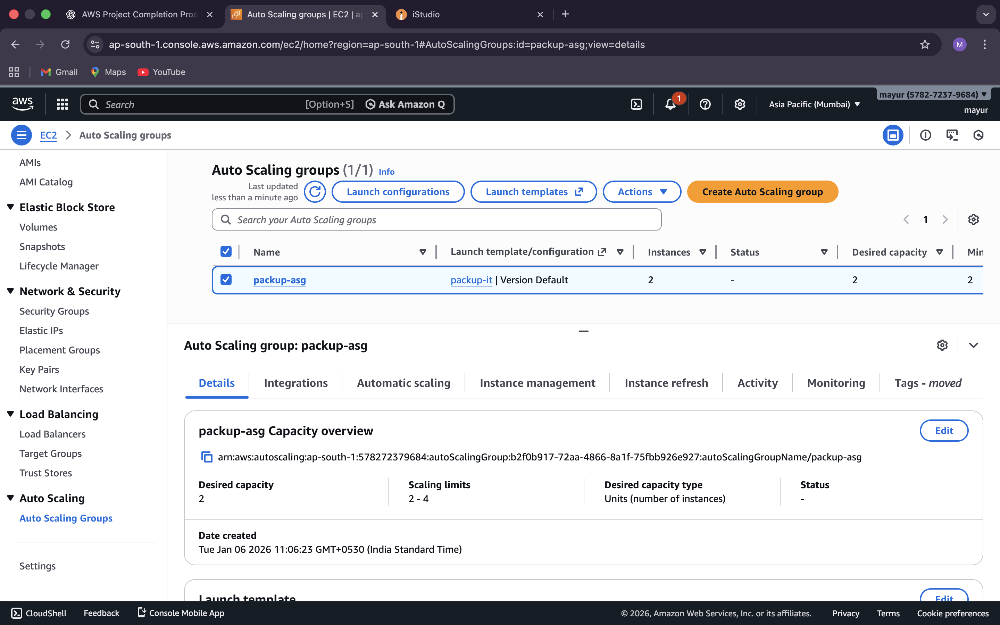
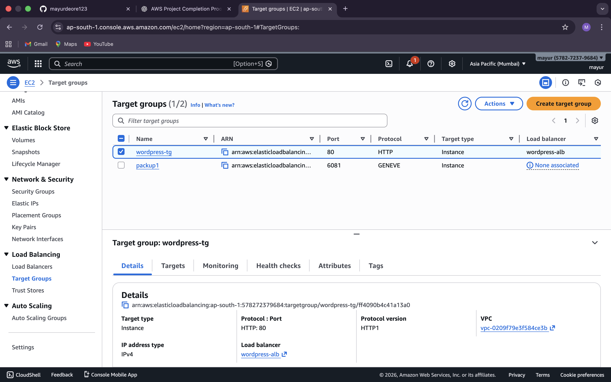
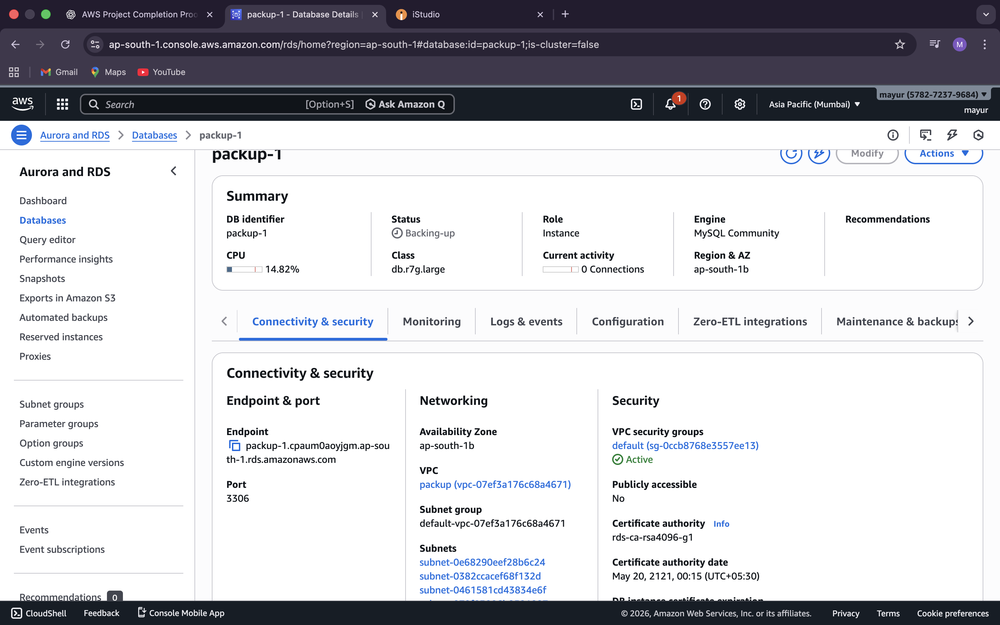
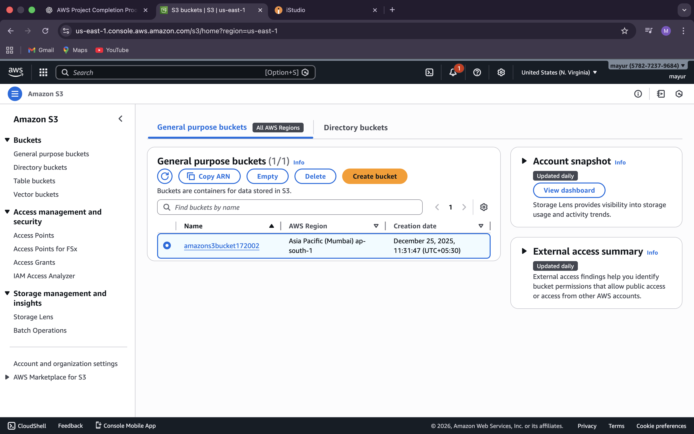
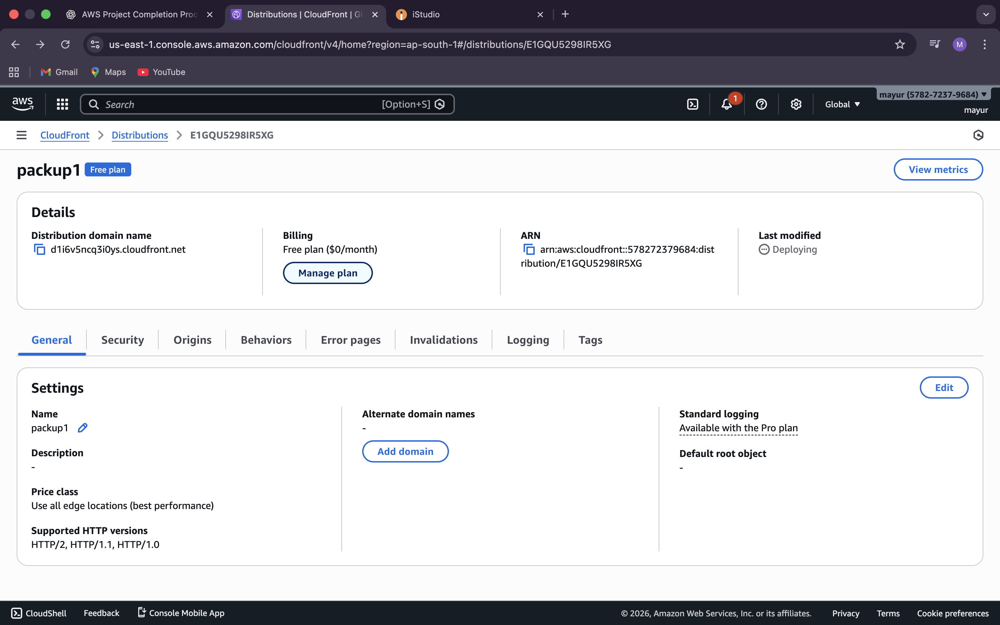

# aws-wordpress-ha-project
AWS Highly Available WordPress Project (Training)

## Project Overview
This project demonstrates a highly available WordPress architecture on AWS using:
•⁠  ⁠EC2 Auto Scaling
•⁠  ⁠Application Load Balancer
•⁠  ⁠Amazon RDS
•⁠  ⁠Amazon S3
•⁠  ⁠CloudFront

Screenshots are provided as proof of implementation.

## AWS Infrastructure Screenshots

	The following screenshots demonstrate the successful setup of the AWS infrastructure used in this project.

### EC2 Instance – Running WordPress

### Application Load Balancer (Active)

### Auto Scaling Group

### Target Group (HTTP 80)

### Amazon RDS – MySQL Database

### Amazon S3 – Storage Bucket

### CloudFront Distribution

